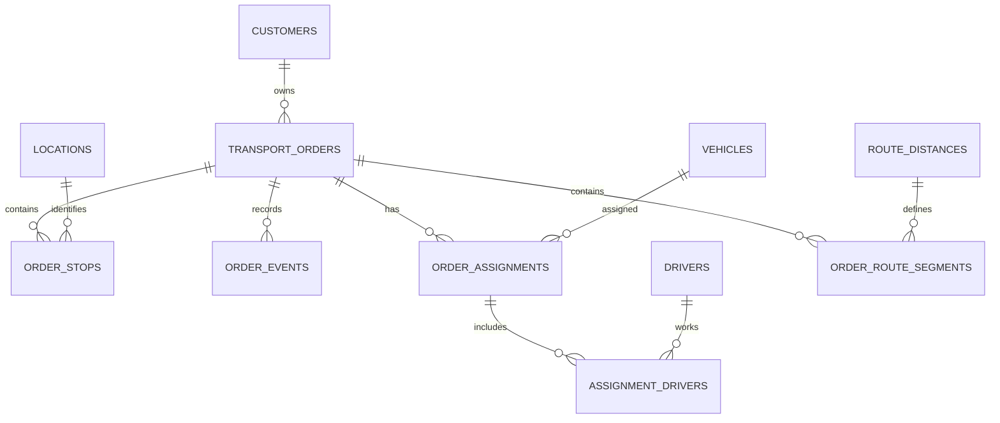

# LogisticsFlow – ERD

```mermaid
erDiagram
    CUSTOMERS ||--o{ TRANSPORT_ORDERS : owns
    TRANSPORT_ORDERS ||--o{ ORDER_STOPS : contains
    LOCATIONS ||--o{ ORDER_STOPS : identifies
    TRANSPORT_ORDERS ||--o{ ORDER_EVENTS : records
    TRANSPORT_ORDERS ||--o{ ORDER_ASSIGNMENTS : has
    VEHICLES ||--o{ ORDER_ASSIGNMENTS : assigned
    ORDER_ASSIGNMENTS ||--o{ ASSIGNMENT_DRIVERS : includes
    DRIVERS ||--o{ ASSIGNMENT_DRIVERS : works
    TRANSPORT_ORDERS ||--o{ ORDER_ROUTE_SEGMENTS : contains
    ROUTE_DISTANCES ||--o{ ORDER_ROUTE_SEGMENTS : defines
```
